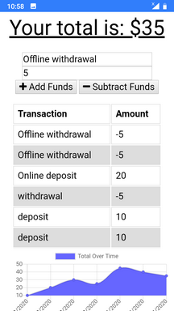

# Budget_Tracker_with_Offline_mode
This is a simple app that allows users to track their budget. Users can enter deposits or expenses which are then stored in a (MongoDB) database. If the user goes offline while the app is loaded, they'll still be able to enter transactions. When the user next goes online, all their offline transactions will be synced with the database.

Most of the front-end and back-end code was provided. My task was to add offline functionality to the app. This was done by caching all offline transactions to the browser's IndexedDB database. When an internet connection is re-established, the cached transactions are retrived from IndexedDB and sent to the server for processing.

## Usage
Navigate to the [app](https://budget-tracker-61035.herokuapp.com) using your mobile browser. Fill in the form fields and click on either the Add or Subtract buttons to record your transaction. 

*While the app is still open in your browser*, disable your wifi. Enter a few more transactions while offline. 

Next, re-enable your wifi. The offline transactions will be synced with the server once the internet connection has been established.

If you close your browser, re-open it, and reload the app, you'll see that your offline transactions are in the transaction list. 

## Try It
You can try the app [here](https://budget-tracker-61035.herokuapp.com).
